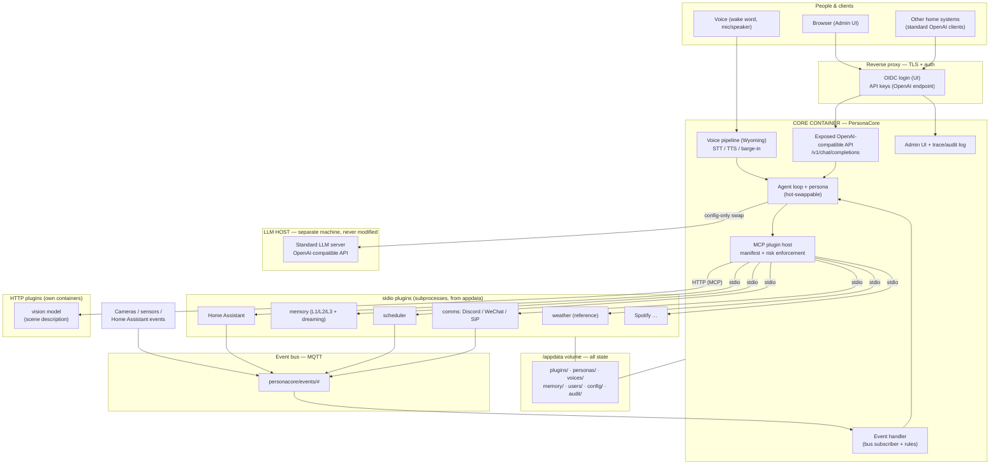
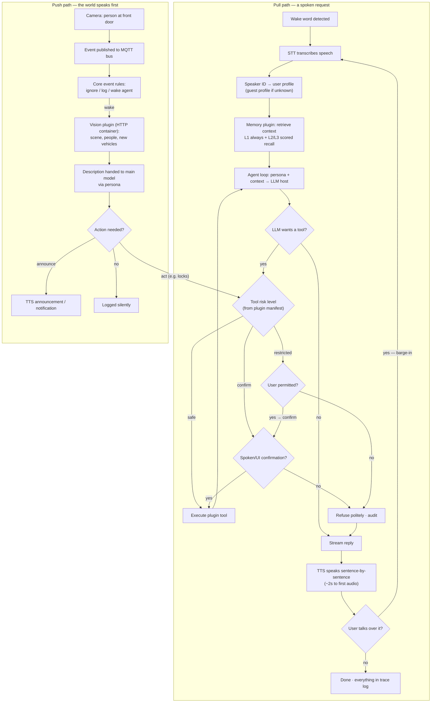

# Overview

What PersonaCore is, what problem it solves, and what shape it has — read this first if you have never seen the project.

## In one paragraph

PersonaCore is a self-hosted, containerised assistant for a household. It talks in a configurable **persona** (a set of standing instructions defining its personality — the "system prompt"), reaches an LLM you already run somewhere else, and gains every capability beyond conversation from **plugins**. It is CPU-only by hard constraint: nothing in this stack needs a GPU, ever. Anything that genuinely does — a large model, heavy vision inference — runs elsewhere and is reached over the network.

It replaces a predecessor project (a GLaDOS voice assistant) that was abandoned because it was too hard to configure. That failure is the reason for the project's loudest rule: configuration happens in a web UI with dropdowns, toggles and validation, never by editing a file and hoping (spec §4.4, [ADR-0010](https://github.com/synssins/personacore-ai/blob/main/docs/adr/0010-runtime-config-lives-in-the-admin-ui.md)).

## The problem it solves

If you self-host an LLM, every client in your house points straight at it. Each one gets a raw model: no persona, no tools, no permissions, no record of what was said. Adding a capability means modifying whatever client you are using, or the model host, or both.

PersonaCore inserts itself once, in the middle:

- Every client keeps talking OpenAI's wire protocol and does not need to change.
- The persona, tool access, risk gating, memory scope and audit trail are applied **in the middle**, where they can be reviewed in one place.
- A new capability is a new plugin, not a change to the core or to any client.

The defining constraint, from spec §4.2: **adding a capability must never require modifying the core.** If a feature request tempts a core change, either the contract is wrong or the feature is a plugin.

## The shape: a small core, and contracts as the product

The core does four things and deliberately nothing else: conversation, persona, voice, and the baseline abilities that ship as bundled plugins. Everything else — home control, memory, music, cameras, messaging — is a plugin. Voice is core code, not a plugin (ADR-0029): every built-in speech engine is compiled into the one image and switched on or off independently.

What actually gets built carefully, therefore, is not features but **contracts** (spec §4.1: "the plugin contract, event bus conventions, and the two OpenAI-compatible interfaces are the product; features are cargo"). There are four:

| Contract | What it fixes | Where |
|---|---|---|
| **Plugin manifest** | What a plugin is, what it may reach, how risky each of its tools is | [Plugin Manifest](Plugin-Manifest), [Risk Levels](Risk-Levels) |
| **Event envelope** | What a pushed message looks like on the bus, and what topic it lands on | [Event Bus](Event-Bus) |
| **Policy profile** | Who a caller is and what they are allowed to do | [Policy Profiles](Policy-Profiles) |
| **The two OpenAI APIs** | How the core reaches your LLM, and how anything else reaches the core | [LLM Roles](LLM-Roles), [OpenAI-Compatible API](OpenAI-Compatible-API) |

Contracts are versioned with semver. Minor versions only ever add, so a 1.3 core runs a plugin written for 1.0 unchanged — see [Plugin Contract Versioning](Plugin-Contract-Versioning).

**A plugin is an MCP server.** MCP (Model Context Protocol) is an open standard for plugging tools into an agent. There is no PersonaCore library to import: if you already have an MCP server, write it a `manifest.toml` and it is already a plugin. See [Plugin Contract](Plugin-Contract).

## What it offers other systems

This is the part most easily missed. **The core is itself an OpenAI-compatible server.** It exposes `/v1/chat/completions` and `/v1/models`, streaming included, so any unmodified OpenAI client works against it.

That means anything with a base-URL field — LobeChat, Open WebUI, Home Assistant's conversation agent, a shell script, a Python notebook — gains, for the cost of changing one URL:

- **A policy layer.** The API key it presents maps to a profile: which tools it may use, what risk ceiling applies, whether it may write to memory, whether it may approve a confirmation. A kitchen display and a workshop terminal can be given genuinely different powers. See [Policy Profiles](Policy-Profiles).
- **A tool gateway.** The plugins you have installed become available to that client, gated by risk. The client never learns what MCP is, never manages a plugin, never holds a credential for anything a plugin talks to.
- **An audit trail.** Every request, every tool call, every confirmation granted or refused is recorded and attributable. Every message in and out is recorded as a transcript. See [Audit and Trace](Audit-And-Trace).
- **A persona layer.** The answers come back in character, with a client-supplied `system` message dropped rather than honoured — a dumb display widget cannot talk its way into a better profile.

See [Scenario: Third-Party Clients](Scenario-Third-Party-Clients) for how to point one at the core.

## Architecture

The whole system, including parts not yet built. The wake-word/microphone pipeline (Wyoming), memory, and most of the plugins shown are P1 and later. Voice itself is not one of those any more — the core's own speech engines speak replies from the Chat screen today — but the diagram keeps the aspirational wake-word path since nothing has replaced it yet; see [Installation and Upgrades](Installation-And-Upgrades) for what runs today.

Three things to take from it:

1. **The LLM host is outside and is never modified.** That is a stated non-goal (spec §14). The core is a *client* of an OpenAI-compatible API and a *server* of one.
2. **`/appdata` is the assistant.** Containers are disposable and rebuildable from the Compose file; every piece of state — plugins, personas, voices, memory, users, config, secrets, audit — lives on that one volume. See [Appdata Layout](Appdata-Layout).
3. **Plugins reach the core two ways, and the core reaches them one way.** Tools are *pull*: the model asks. The bus is *push*: the world tells the assistant something happened. There is no third channel, and no plugin ever addresses the core directly.

## Request and event flow

The pull path is the agent loop; the push path is the bus. `Wake word detected`, `STT transcribes speech` and `Speaker ID` are the P1 microphone pipeline and are **not built** — today the same loop is entered from the admin Chat screen (typed, or dictated through the browser's own speech recogniser) or from `/v1/chat/completions` instead. `TTS speaks`, further down, **is** built: the Chat screen's replies can be spoken by the core's own switchable engines. The risk gate in the middle is built and enforced.

The risk gate fails closed at every branch: an unknown tool, a tool outside the caller's allowlist, an unrankable risk, a missing permission, or a confirmation channel that is not there — each is a refusal, and there is no default-allow anywhere in it. See [Risk Levels](Risk-Levels).

## What is built today

P0 (core and contracts) has passed its phase gate. Broadly: contracts, the LLM client with per-role circuit breakers, audit and transcript storage, plugin discovery and the MCP plugin host over both transports, the agent loop with its risk gate and untrusted-content fencing, the exposed OpenAI-compatible API with key auth, the admin API, and the designed admin UI on top of it.

The admin UI's **Chat screen is now the front door**: the root path lands on it, conversations are multi-turn with a rail of resumable earlier threads, a persona picker sits on the chat screen itself without moving the core's default persona, dictation uses the browser's own speech recogniser, and replies can be spoken back. Generation statistics (tokens in/out, tokens per second, time to first token) are not built. The Personas screen, the Access keys screen, the Plugins screen's install form, and the Voice screens (engine switches and the installed-voice list) are also built now.

Not built: the wake-word/microphone pipeline, memory, speaker identification, streaming speech, a remote speech engine reached over the network, and the confirmation channel that a `confirm`-risk tool needs (see [Scenario: Confirm and Restricted Tools](Scenario-Confirm-And-Restricted-Tools)).

## Where to go next

- Running it: [Installation and Upgrades](Installation-And-Upgrades), then [Scenario: First Run](Scenario-First-Run).
- Pointing it at a model: [Scenario: Connecting an LLM](Scenario-Connecting-An-LLM).
- Adding a capability: [Scenario: Writing a Plugin](Scenario-Writing-A-Plugin).
- Unfamiliar words: [Glossary](Glossary).
